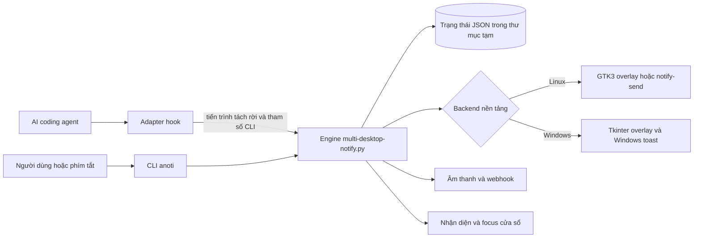
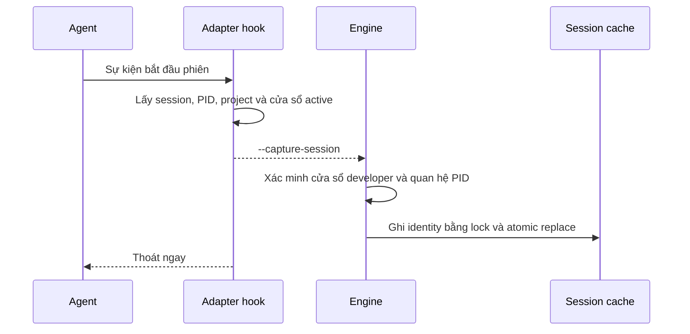
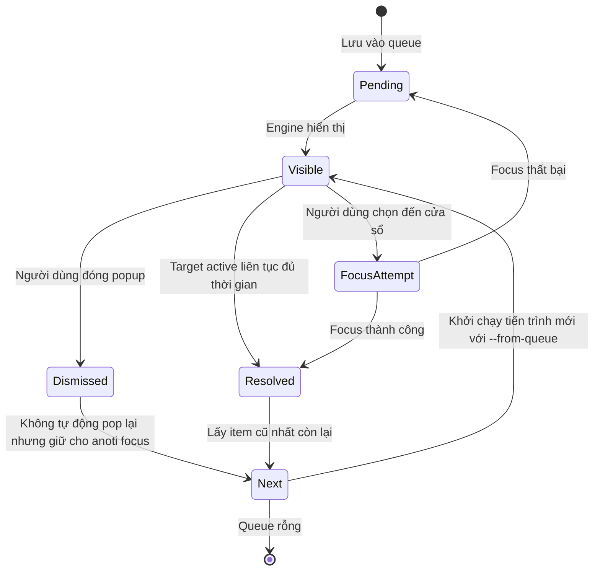

# Thiết kế kiến trúc AI agent desktop notifier

## 1. Mục đích và phạm vi

Tài liệu này mô tả kiến trúc **đang được triển khai trong mã nguồn hiện tại** của `anoti`. Đây là tài liệu định hướng cho agent và lập trình viên trước khi sửa mã, bổ sung agent mới, thay đổi cách tìm cửa sổ hoặc mở rộng backend thông báo.

Phạm vi gồm:

- adapter nhận sự kiện từ Claude Code, OpenAI Codex và Google Antigravity;
- engine thông báo dùng chung trên Linux và Windows;
- nhận diện, lưu và kích hoạt lại cửa sổ phát sinh sự kiện;
- hàng đợi, chống lặp, âm thanh, webhook và vòng đời popup;
- CLI, cài đặt, cập nhật, gỡ cài đặt và kiểm thử;
- các bất biến cần giữ và các giới hạn kỹ thuật hiện có.

Tài liệu không đề xuất viết lại hệ thống. Phần “Rủi ro và hướng cải thiện” chỉ ghi lại những điểm cần cân nhắc khi phát triển tiếp.

Nguồn sự thật theo thứ tự ưu tiên:

1. Mã nguồn và kiểm thử trong repository.
2. Tài liệu này.
3. `README.md` và tài liệu hướng dẫn theo nền tảng.

Khi hành vi thay đổi, cần cập nhật mã nguồn, kiểm thử liên quan và tài liệu này trong cùng một thay đổi.

## 2. Tóm tắt kiến trúc

Hệ thống dùng kiến trúc theo tiến trình ngắn hạn, không có daemon thường trú:



Các quyết định thiết kế chính:

- Hook phải thoát nhanh và không được làm hỏng vòng đời của agent.
- Mọi agent chuẩn hóa sự kiện thành cùng một hợp đồng dòng lệnh cho engine.
- Chỉ một nhóm popup được hiển thị tại một thời điểm; các yêu cầu khác nằm trong hàng đợi.
- Hệ thống ưu tiên không focus nhầm. Khi không xác định duy nhất được cửa sổ, engine trả về không có mục tiêu thay vì đoán.
- Trạng thái ngắn hạn được chia sẻ giữa các tiến trình qua tệp JSON trong thư mục tạm.
- Linux và Windows dùng chung logic nghiệp vụ, nhưng tách backend hiển thị và tích hợp hệ điều hành.

## 3. Bản đồ repository

| Đường dẫn | Trách nhiệm | Khi nào cần sửa |
| --- | --- | --- |
| `bin/multi-desktop-notify.py` | Engine trung tâm: trạng thái, chọn cửa sổ, hàng đợi, focus, popup, toast, âm thanh và webhook | Khi thay đổi hành vi runtime dùng chung hoặc backend giao diện |
| `bin/anoti` | CLI quản lý và gửi thông báo tùy chỉnh | Khi thêm lệnh cho người dùng hoặc thay đổi cách gọi engine |
| `bin/anoti.cmd`, `bin/anoti.ps1` | Wrapper để gọi CLI trên Windows | Khi cách khởi chạy CLI trên Windows thay đổi |
| `hooks/claude-notify.sh` | Adapter Claude Code được cài trên Linux | Khi payload hoặc sự kiện Claude trên Linux thay đổi |
| `hooks/claude-notify.py` | Adapter Claude Code được cài trên Windows | Khi payload hoặc sự kiện Claude trên Windows thay đổi |
| `hooks/codex-notify.py` | Adapter Codex đa nền tảng | Khi hợp đồng `notify` hoặc hook của Codex thay đổi |
| `hooks/antigravity-notify.sh` | Adapter Antigravity được cài trên Linux; tên có đuôi `.sh` nhưng nội dung là Python | Khi payload hoặc sự kiện Antigravity trên Linux thay đổi |
| `hooks/antigravity-notify.py` | Adapter Antigravity được cài trên Windows | Khi payload hoặc sự kiện Antigravity trên Windows thay đổi |
| `gnome-shell-extension/` | Adapter compositor dùng D-Bus để focus và kiểm tra trạng thái active của cửa sổ native Wayland trên GNOME Shell 42–50 | Khi thay đổi identity, focus hoặc auto-dismiss trên Wayland |
| `install.sh`, `install.ps1` | Cài file runtime, hợp nhất cấu hình agent và gửi thông báo thử | Khi thêm artifact, dependency hoặc tích hợp mới |
| `update.sh`, `update.ps1` | Lấy bản mới và đồng bộ lại cài đặt | Khi quy trình phát hành hoặc migration thay đổi |
| `uninstall.sh`, `uninstall.ps1` | Xóa artifact và cấu hình tích hợp | Khi installer bắt đầu sở hữu thêm dữ liệu |
| `tests/test_focus_identity_and_timer.py` | Kiểm thử nhận diện cửa sổ, session cache, focus, queue và timer | Khi thay đổi logic identity hoặc vòng đời popup |
| `tests/test_multi_monitor_notify.py` | Kiểm thử backend Linux và bố trí đa màn hình | Khi thay đổi chọn backend hoặc placement |
| `tests/test_remediation_and_adapters.py` | Kiểm thử remediation bảo mật, hàng đợi, adapter và lifecycle | Khi sửa đổi logic locking, runtime dir hoặc unmerge |
| `tests/test_agent_hooks_e2e.py` | Kiểm thử tích hợp mô phỏng toàn diện cho Google Antigravity, Claude Code và OpenAI Codex | Khi cập nhật hook payload hoặc sự kiện của agent |

## 4. Mô hình triển khai

Repository là nguồn phát triển, nhưng hook không chạy trực tiếp từ repository. Installer sao chép artifact vào hồ sơ người dùng:

| Artifact runtime | Linux | Windows |
| --- | --- | --- |
| Engine | `~/.local/bin/multi-desktop-notify.py` | `%USERPROFILE%\.local\bin\multi-desktop-notify.py` |
| CLI | `~/.local/bin/anoti` | `%USERPROFILE%\.local\bin\anoti` và các wrapper `.cmd`, `.ps1` |
| Claude | `~/.claude/hooks/notify-input.sh` | `%USERPROFILE%\.claude\hooks\notify-claude.py` |
| Codex | `~/.codex/notify.py` | `%USERPROFILE%\.codex\notify.py` |
| Antigravity | `~/.gemini/hooks/notify-antigravity.sh` | `%USERPROFILE%\.gemini\hooks\notify-antigravity.py` |
| Adapter focus Wayland | `~/.local/share/gnome-shell/extensions/ai-agent-desktop-notifier@sonnx24042005` | Không áp dụng |

Hệ quả quan trọng: sửa file trong repository không làm thay đổi bản đang chạy trong hồ sơ người dùng cho đến khi chạy lại installer hoặc updater. Trên GNOME Wayland, mã JavaScript của extension đã nạp chỉ được thay thế hoàn toàn ở phiên Shell tiếp theo; `FocusWindow` ba tham số được giữ để engine tương thích với runtime v1 trong thời gian chuyển tiếp, còn runtime v2 bổ sung `FocusWindowV2` và `IsWindowActive`.

## 5. Thành phần và trách nhiệm

### 5.1. Adapter hook

Adapter là lớp chống thay đổi giữa payload riêng của từng agent và engine dùng chung. Mỗi adapter làm sáu việc:

1. Đọc JSON từ `stdin` hoặc đối số phù hợp với agent.
2. Bỏ qua sự kiện nền, sự kiện không cần hành động và trạng thái khởi tạo im lặng.
3. Nhận diện loại sự kiện: bắt đầu phiên, câu hỏi, yêu cầu quyền hoặc hoàn thành.
4. Trích xuất `session_id`, PID gọi, cửa sổ đang hoạt động, tên dự án và identity agent.
5. Chuyển payload thành tham số dòng lệnh chuẩn của engine.
6. Khởi chạy engine bất đồng bộ, chuyển `stdout`, `stderr` và `stdin` sang thiết bị rỗng.

Adapter phải ưu tiên tính an toàn cho agent: payload lỗi hoặc lỗi gửi thông báo không được làm hook trả lỗi gây gián đoạn agent.

### 5.2. Engine trung tâm

`bin/multi-desktop-notify.py` là một module đơn nhưng có các vùng trách nhiệm rõ ràng:

- khóa liên tiến trình và thao tác JSON;
- session cache và xác minh identity cửa sổ;
- chống lặp và hàng đợi;
- webhook, âm thanh và thông báo dự phòng;
- truy vấn cửa sổ và cây tiến trình theo nền tảng;
- chọn, focus và chuyển workspace;
- dựng popup Windows bằng Tkinter;
- dựng popup Linux bằng GTK3/GDK;
- dò trạng thái cửa sổ nền bằng `AsyncWindowActivityProbe`, không chạy truy vấn hệ thống trên luồng giao diện;
- xử lý yêu cầu focus nền bằng `AsyncWindowFocusRequest`, chỉ cập nhật và đóng popup trên luồng giao diện sau khi focus thành công;
- đặt vị trí mỗi overlay X11/XWayland đúng một lần sau allocation hợp lệ đầu tiên để tránh vòng lặp configure/allocate;
- điều phối CLI và vòng đời tiến trình.

Không nên đưa logic hiểu payload riêng của agent vào engine. Logic đó thuộc adapter. Ngược lại, không nên sao chép logic queue, focus hoặc render vào adapter.

### 5.3. CLI `anoti`

CLI là giao diện thao tác thủ công và quản lý vòng đời:

- `anoti focus`: focus thông báo cũ nhất đang chờ (`Alt+Q`);
- `anoti doctor`: kiểm tra chuyên sâu tính toàn vẹn hệ thống, dependencies và phát hiện lệch phiên bản giữa working tree với installed runtime;
- `anoti test`: gửi một thông báo thử qua engine đã cài;
- `anoti status`: kiểm tra sự tồn tại của engine và cấu hình tích hợp;
- `anoti config`: tạo hoặc hiển thị cấu hình webhook;
- `anoti install`, `update`, `uninstall`: gọi script theo nền tảng;
- `anoti --title ... --message ...`: gửi thông báo tùy chỉnh.

CLI luôn tìm engine trong `~/.local/bin`, không mặc định chạy engine trong repository. Khi làm việc trong repository, cần dùng `anoti doctor` để kiểm tra đồng bộ.

### 5.4. Script quản lý vòng đời

Installer tạo thư mục đích, sao chép artifact, cấu hình hook và gửi thông báo thử. Updater cài lại artifact từ nguồn mới. Uninstaller xóa artifact và các mục cấu hình mà dự án quản lý.

Linux đăng ký thêm phím tắt GNOME `Alt+Q` bằng `gsettings`. Windows không đăng ký phím tắt toàn cục; người dùng có thể dùng `anoti focus` hoặc giải pháp ngoài như AutoHotkey.

## 6. Hợp đồng sự kiện theo agent

| Agent | Bắt session sớm | Câu hỏi | Quyền | Hoàn thành | Ghi chú |
| --- | --- | --- | --- | --- | --- |
| Claude Code | `SessionStart` | `AskUserQuestion` | `permission_prompt` hoặc `PermissionRequest` | `Stop` hoặc `agent_completed` | Bỏ qua `idle_prompt`, `agent_needs_input` và khởi tạo agent-to-agent |
| Codex | Code adapter hỗ trợ `SessionStart` qua stdin, nhưng installer hiện chưa đăng ký sự kiện này | Chưa có nhánh câu hỏi riêng | `PermissionRequest` | `agent-turn-complete` | Lệnh `notify` có thể truyền JSON ở đối số thứ nhất; hook quyền truyền JSON qua stdin |
| Antigravity | `PreInvocation` hoặc payload có `invocationNum` | Tên tool chứa `ask` | Không tạo popup riêng trong adapter hiện tại | Chỉ khi kiểm tra `fullyIdle`, lỗi, lý do kết thúc và transcript đều cho thấy đã dừng thật | Tool call không phải câu hỏi phải trả `{"decision":"allow"}` ngay |

Payload khác nhau được chuẩn hóa thành các trường sau:

| Tham số engine | Ý nghĩa |
| --- | --- |
| `--app-name` | Tên agent dùng cho nhãn và webhook |
| `--title` | Tiêu đề phân loại hiển thị trên banner |
| `--message` | Nội dung đã thu gọn khoảng trắng |
| `--questions-json` | Payload câu hỏi để engine trích xuất tóm tắt hiển thị |
| `--urgency` | `low`, `normal` hoặc `critical` |
| `--event-type` | Loại sự kiện chuẩn hóa: `question`, `permission`, `complete`, `info` |
| `--sound` | Đường dẫn âm thanh; Windows có thể dùng âm hệ thống khi rỗng |
| `--window-id` | ID cửa sổ đang hoạt động tại thời điểm hook chạy |
| `--caller-pid` | PID để lần ngược cây tiến trình |
| `--project-hint` | Tên thư mục dự án để đối chiếu tiêu đề cửa sổ |
| `--caller-tty` | TTY của tiến trình gọi trên Linux; hiện được adapter truyền nhưng chưa tham gia thuật toán chọn cửa sổ hiện tại |
| `--terminal-screen` | Marker GNOME Terminal; hiện được truyền nhưng chưa tham gia thuật toán chọn cửa sổ hiện tại |
| `--session-id` | Khóa ổn định để liên kết agent session với cửa sổ |
| `--timeout` | Số giây tự đóng; `0` nghĩa là không tự đóng theo timeout |

`--app-name` đồng thời được lưu thành `app_hint` khi bắt session và truyền xuyên suốt queue, nút đến cửa sổ, `anoti focus` và adapter Wayland. Identity này xử lý các trường hợp tên cửa sổ không chứa tên dự án, đặc biệt Codex desktop có class `Chatgpt` và Antigravity có class ứng dụng riêng.

## 7. Luồng xử lý chính

### 7.1. Bắt identity đầu phiên



Mục đích của luồng này là chụp cửa sổ khi quan hệ còn rõ ràng, trước khi người dùng chuyển sang ứng dụng khác.

### 7.2. Hiển thị một thông báo

`main()` của engine thực hiện theo thứ tự:

1. Xử lý lệnh đặc biệt `focus`, `install`, `update`, `uninstall` hoặc `capture-session`.
2. Làm sạch nội dung, giới hạn mặc định còn 300 ký tự.
3. Bỏ qua bản trùng trong khoảng `dedupe_seconds`, mặc định là 2 giây.
4. Kết thúc popup cũ bằng PID file và kiểm tra danh tính tiến trình để tránh chồng nhiều nhóm popup.
5. Tìm cửa sổ mục tiêu theo thuật toán identity nghiêm ngặt.
6. Tạo khóa queue theo session, window, PID, project hoặc khóa mặc định.
7. Cập nhật item vào queue cho mọi loại sự kiện, kể cả hoàn thành, để nút đến cửa sổ và `Alt+Q` dùng cùng identity trong lúc popup còn hiển thị. Đường `--from-queue` không ghi ngược item vừa lấy.
8. Phát âm thanh và gửi webhook trong nền.
9. Chọn backend theo hệ điều hành và hiển thị popup.

### 7.3. Đóng, focus và chuyển thông báo



Khi focus bằng `anoti focus` hoặc phím tắt toàn cục `Alt+Q`, engine duyệt từ item cũ nhất và chuyển `app_name` của item thành `app_hint` cho cùng bộ phân giải mà nút popup sử dụng. Item chỉ bị xóa sau khi focus đã được xác minh thành công. Nếu không có queue hợp lệ, engine thử session cache mới cập nhật gần nhất. Engine không focus một cửa sổ developer ngẫu nhiên.

Trong popup, thao tác focus thành công hoặc tự động đóng sau khi đã vào cửa sổ active (`auto-dismiss on active window`) sẽ giải phóng và xóa item khỏi queue. Cả hai backend dùng chung `update_auto_dismiss_state()` để chỉ đóng khi identity mục tiêu được xác nhận active liên tục đủ `auto_dismiss_delay` (mặc định 1,5 giây); khi người dùng chuyển sang cửa sổ khác, mốc thời gian được đặt lại. Trên GNOME Wayland, `AsyncWindowActivityProbe` gọi `IsWindowActive` của adapter compositor trước, tránh quét AT-SPI có thể treo; AT-SPI chỉ còn là fallback khi adapter không khả dụng. Nút đến cửa sổ gửi một `AsyncWindowFocusRequest` single-flight riêng và gọi cùng hợp đồng `FocusWindow` với `Alt+Q`; nút chuyển sang trạng thái `Đang chuyển...` trong lúc xử lý, bật lại nếu focus thất bại, còn popup chỉ đóng sau khi focus thành công. Trên GTK, khung nền bỏ qua sự kiện chuột bắt nguồn từ `Gtk.Button` hoặc widget con của nút để không đóng popup trước tín hiệu `clicked`. Luồng Tkinter/GTK chỉ lấy kết quả đã hoàn thành nên vẫn xử lý vẽ, đóng và sự kiện ngay cả khi API cửa sổ hoặc tiến trình con phản hồi chậm.

## 8. Thuật toán nhận diện cửa sổ và chính sách focus

`find_target_window()` áp dụng thứ tự phân giải 4 tầng nghiêm ngặt (ưu tiên độ chính xác tuyệt đối, không đoán mò):

1. **Tầng 0 (Session cache - Schema v2)**: Tra cứu window ID đã lưu tại `SessionStart` / `PreInvocation`. Thực hiện kiểm tra 3 bước: (a) Cửa sổ còn tồn tại và là developer window, (b) PID tiến trình sở hữu cửa sổ khớp với PID lúc capture (chống tái sử dụng HWND/WID), (c) Tiêu đề cửa sổ khớp hoặc tương thích với `title_fingerprint` / `project_hint`.
2. **Tầng 1 (Cây tiến trình tổ tiên - Process Ancestry)**: Phân tích an toàn `/proc/{pid}/stat` (Linux) hoặc Toolhelp snapshot (Windows). Nếu có duy nhất 1 cửa sổ developer trong cây tiến trình -> chấp nhận; nếu có nhiều cửa sổ -> dùng `project_hint` để phân định duy nhất; nếu vẫn còn mơ hồ -> trả về rỗng (từ chối đoán).
3. **Tầng 2 (Khớp Project Hint duy nhất)**: Tìm kiếm `project_hint` trong tiêu đề các cửa sổ developer đang mở. Chỉ chấp nhận khi tìm thấy đúng 1 cửa sổ duy nhất.
4. **Tầng 3 (Window ID truyền trực tiếp)**: Kiểm tra window ID hợp lệ, thuộc ứng dụng developer và thuộc cây tiến trình tổ tiên của caller.
5. **Tầng 4 (Wayland GNOME Terminal fallback)**: Kích hoạt GNOME Terminal qua D-Bus (`org.gnome.Terminal.Preferences`) khi chạy Wayland thuần.
6. **Tầng 5 (An toàn tuyệt đối)**: Trả về chuỗi rỗng khi không thể xác định duy nhất mục tiêu. Tuyệt đối không chọn bừa cửa sổ ngẫu nhiên.

### 8.1. Bộ đếm thời gian monotonic (1,5 giây active liên tục)
- Sử dụng `time.monotonic()` và chu kỳ lấy kết quả 100 ms trên luồng giao diện.
- Mỗi lượt dò identity và trạng thái active chạy trên luồng nền; probe mới không được tạo khi lượt trước còn chạy hoặc kết quả chưa được lấy.
- Trên GNOME Wayland, adapter lấy cửa sổ focus trực tiếp từ compositor và đối chiếu PID, project, title cùng `app_hint`; `FocusWindowV2` chỉ kích hoạt ứng viên duy nhất ở tầng identity mạnh nhất, `FocusWindow` giữ tương thích v1, còn `IsWindowActive` chỉ kiểm tra cửa sổ đang focus và không làm thay đổi focus.
- Các lệnh truy vấn cửa sổ X11 dùng timeout 0,75 giây để tiến trình con không bị treo vô hạn.
- Trên X11 và Windows: Đối chiếu chính xác ID cửa sổ active (`_NET_ACTIVE_WINDOW` / `GetForegroundWindow`).
- Trên Linux Wayland thuần: Đọc cửa sổ active qua AT-SPI và đối chiếu PID tổ tiên, project hint hoặc session fingerprint. PTY chỉ là fallback khi AT-SPI không khả dụng.
- Reset `active_since = None` ngay lập tức khi người dùng chuyển sang cửa sổ khác hoặc rời khỏi terminal.
- Chỉ đóng thông báo và dequeue khi đúng cửa sổ nguồn active liên tục đủ 1,5 giây.

### 8.2. Xác minh và kích hoạt cửa sổ theo nền tảng

Trên Windows, engine:
- Khôi phục cửa sổ nếu đang thu nhỏ (`IsIconic` -> `ShowWindow(hwnd, SW_RESTORE)` (9));
- Vượt qua Foreground Lock bằng `AttachThreadInput` (kết nối foreground thread, target thread và current thread) kết hợp `SwitchToThisWindow(hwnd, True)`;
- Gọi `BringWindowToTop`, `SetForegroundWindow`, `SetActiveWindow`;
- Kiểm tra lại foreground window trong tối đa khoảng 0,4 giây.

Trên Linux X11/XWayland, engine:
- Chuyển sang workspace chứa cửa sổ (`_NET_WM_DESKTOP`);
- Gửi EWMH ClientMessage `_NET_ACTIVE_WINDOW` kèm timestamp `CurrentTime` và `source indication = 2`;
- Gọi `gdk_win.focus()`, `wmctrl -i -a` và `xdotool windowactivate --sync`;
- Kiểm tra lại active window trong tối đa khoảng 0,4 giây.

Session cache schema v3 tách `window_pid` của cửa sổ X11 khỏi `caller_pid` của hook. Khi đọc cache schema v2 do capture hook tạo, engine không còn so PID ngắn hạn của hook với PID sở hữu cửa sổ. Nhờ đó nút đến cửa sổ, tự động đóng và `Alt+Q` vẫn nhận diện đúng cửa sổ sau khi hook đã kết thúc. Entry schema v3 có `window_pid=0` được hiểu là chưa biết PID cửa sổ và không dùng `caller_pid` thay thế.

Trên GNOME Wayland native, engine không giả lập X11. `focus_wayland_target_window()` gửi identity gồm caller PID, project hint và title fingerprint qua D-Bus đến adapter GNOME Shell. Adapter chạy trong compositor, chỉ chấp nhận cửa sổ developer khớp duy nhất rồi gọi `Main.activateWindow()` để chuyển workspace và đưa cửa sổ lên foreground. Khi adapter trả về thành công, engine chấp nhận kết quả ngay vì việc chọn duy nhất và kích hoạt đã diễn ra trong compositor; engine không quét lại AT-SPI đồng bộ, tránh bị chặn bởi một accessibility client không phản hồi. Chỉ khi adapter thất bại, engine mới phân giải và thử fallback X11/XWayland. Nếu target mơ hồ hoặc focus thất bại, popup và queue item được giữ nguyên để người dùng thử lại.

## 9. Trạng thái và dữ liệu runtime

### 9.1. Tệp trạng thái

| Tệp | Nội dung | Chính sách vòng đời |
| --- | --- | --- |
| `ai_agent_notifier.pid` | PID popup hiện tại | Ghi đè khi có thông báo mới |
| `ai_agent_notifier_sessions.json` | Ánh xạ session sang identity cửa sổ | Giữ tối đa 64 entry, loại entry quá 24 giờ |
| `ai_agent_notifier_sessions.lock` | Lock cho session cache | `flock` trên Linux, thư mục lock quay vòng trên Windows |
| `ai_agent_notifier_dedupe.json` | SHA-256 của app, title, message và thời điểm gần nhất | Loại key cũ hơn 60 giây khi có lần kiểm tra mới |
| `ai_agent_notifier_queue.json` | Các thông báo đang chờ theo identity | Bọc transaction lock và atomic write, bỏ qua item cũ hơn 4 giờ |
| `ai_agent_notifier_queue.lock` | Lock cho queue cache | Được toàn bộ hàm đọc/ghi queue sử dụng |

Thư mục runtime được cô lập an toàn: ưu tiên `$AI_AGENT_NOTIFIER_RUNTIME_DIR`, sau đó là `$XDG_RUNTIME_DIR/ai-agent-notifier` (Linux) hoặc `%LOCALAPPDATA%\ai-agent-notifier` (Windows), fallback `/tmp/ai-agent-notifier-<uid>` với quyền riêng tư `0700` / `0600`.

### 9.2. Schema session cache

```json
{
  "session-id": {
    "schema_version": 3,
    "window_id": "12345",
    "window_id_dec": "12345",
    "project_hint": "project-name",
    "pid": 1234,
    "window_pid": 1234,
    "caller_pid": 5678,
    "app_hint": "",
    "title_fingerprint": "",
    "precision": "window",
    "backend": "x11",
    "updated_at": 1770000000.0
  }
}
```

Trong schema v3, `pid` giữ PID sở hữu cửa sổ để tương thích reader cũ; mã mới dùng rõ ràng `window_pid` và `caller_pid`. Reader vẫn chấp nhận schema v2, trong đó entry capture có `app_hint` được hiểu là đang lưu PID hook trong `pid`. `precision="window"` không được ghi đè bằng identity độ chính xác thấp hơn. `window_id` cũng có thể là token `wayland:gnome-terminal`.

### 9.3. Schema queue

```json
{
  "sess_example": {
    "key": "sess_example",
    "app_name": "Claude Code",
    "title": "Claude Code: Câu hỏi",
    "message": "Nội dung đã làm sạch",
    "questions_json": "{}",
    "urgency": "critical",
    "event_type": "question",
    "sound": "/path/to/sound.oga",
    "target_window_id": "12345",
    "caller_pid": 1234,
    "project_hint": "project-name",
    "session_id": "example",
    "timeout": 0,
    "dismissed": false,
    "created_at": 1770000000.0
  }
}
```

Thứ tự ưu tiên của khóa queue là `session_id` → `window_id` → `caller_pid` → `project_hint` → `default_target`. Một sự kiện mới cùng khóa thay thế item cũ thay vì tạo thêm bản sao.

### 9.4. Cấu hình webhook

Cấu hình bền vững duy nhất do runtime đọc là:

- Linux: `~/.config/ai-agent-notifier/config.json`;
- Windows: `%USERPROFILE%\.config\ai-agent-notifier\config.json`.

Schema:

```json
{
  "webhooks": {
    "slack": "",
    "discord": "",
    "bark": "",
    "ntfy": "",
    "feishu": "",
    "dingtalk": ""
  }
}
```

Mỗi webhook chạy nối tiếp trong một daemon thread, timeout từng request là 3 giây. Lỗi được bỏ qua và không có retry.

## 10. Backend giao diện và tích hợp nền tảng

| Khả năng | Linux X11/XWayland | Linux Wayland thuần | Windows 10/11 |
| --- | --- | --- | --- |
| Overlay | GTK3/GDK | GTK3 nếu khởi tạo được | Tkinter |
| Đặt đúng từng màn hình | Có, mỗi monitor một cửa sổ | Không bảo đảm; chỉ tạo một cửa sổ để tránh cascade | Có, dùng Win32 monitor API |
| Không giành focus | `accept_focus=false`, notification window hint | Phụ thuộc compositor | `WS_EX_NOACTIVATE` |
| Nhận diện cửa sổ active | `_NET_ACTIVE_WINDOW` qua `xdotool`/`xprop` | AT-SPI, đối chiếu PID, session và project | `GetForegroundWindow` |
| Popup dự phòng | `notify-send` | `notify-send` | Windows toast |
| Focus | GDK X11, `wmctrl`, `xdotool` | Adapter GNOME Shell qua D-Bus; GNOME Terminal D-Bus là fallback | Win32 API |
| Chuyển workspace | `wmctrl` | Bị giới hạn bởi compositor | Không áp dụng |
| Âm thanh | `paplay`, `pw-play`, `canberra-gtk-play` hoặc `aplay` | Tương tự | `winsound` khi có `--sound`; toast còn tuân theo cài đặt âm thanh hệ thống |

Backend Linux có hai biến override phục vụ chẩn đoán:

- `NOTIFY_BACKEND=x11|xwayland|wayland`;
- `NOTIFY_FORCE_WAYLAND=1`.

`DEBUG_NOTIFY=1` in thông tin backend, số monitor và tọa độ placement.

Trên Wayland native, `_NET_ACTIVE_WINDOW` không biểu diễn cửa sổ Wayland và thường trả về `0x0`. Engine vì vậy đọc các top-level window đang active qua AT-SPI, sau đó đối chiếu PID tổ tiên, project hint, session fingerprint hoặc marker GNOME Terminal. Nếu AT-SPI không khả dụng, engine chỉ dùng fallback terminal khi TTY vừa có I/O và một tiến trình trong cây tổ tiên đang sở hữu foreground process group; việc chỉ tồn tại một TTY không đủ để kết luận cửa sổ đang active.

## 11. Phụ thuộc runtime

### 11.1. Phụ thuộc bắt buộc hoặc gần bắt buộc trên Linux

- Python 3;
- `jq` cho adapter shell của Claude;
- `xdotool` và `xprop` cho nhận diện cửa sổ X11;
- PyGObject với GTK3/GDK cho overlay;
- typelib AT-SPI 2 qua PyGObject để nhận diện cửa sổ active trên Wayland native; nếu thiếu, engine dùng fallback terminal có điều kiện;
- `notify-send` cho fallback;
- ít nhất một trình phát âm thanh nếu cần âm thanh;
- `wmctrl` để chuyển workspace và tăng độ tin cậy khi focus;
- `gdbus` cho GNOME Terminal trên Wayland;
- `gnome-extensions` và adapter đi kèm dự án để focus cửa sổ native Wayland;
- `gsettings` nếu muốn đăng ký `Alt+Q` trên GNOME.

Installer Linux hiện kiểm tra một phần các dependency này và chỉ hướng dẫn người dùng cài, không tự cài package hệ thống.

### 11.2. Phụ thuộc trên Windows

- Windows 10 hoặc 11;
- Python 3.8 trở lên có Tkinter;
- PowerShell 5.1 trở lên;
- các API Win32 và Windows Runtime có sẵn trong hệ điều hành.

## 12. Chính sách lỗi và khả năng quan sát

Thiết kế hiện tại ưu tiên “thông báo không được làm gián đoạn agent”:

- adapter và engine bắt phần lớn exception rồi thoát mã `0`;
- tiến trình popup được tách khỏi hook;
- âm thanh, toast và webhook chạy nền;
- khi overlay không khởi tạo được, engine thử thông báo hệ thống;
- khi focus thất bại, queue item được giữ lại trong luồng `anoti focus`.

Đổi lại, lỗi runtime thường không xuất hiện trên terminal. Khả năng quan sát hiện có gồm:

- `DEBUG_NOTIFY=1` cho backend Linux;
- `/tmp/antigravity_hook_debug.log` hoặc file cùng tên trong `%TEMP%` cho raw payload Antigravity;
- `anoti status` để kiểm tra cấu hình ở mức tồn tại.

Không nên thay đổi hook sang fail-closed. Nếu bổ sung logging, cần giới hạn kích thước, loại bỏ dữ liệu nhạy cảm và không chặn tiến trình agent.

## 13. Kiểm thử

Chạy toàn bộ kiểm thử hiện có bằng một worker:

```bash
python3 -m unittest discover -s tests -p 'test_*.py' -v
```

Phạm vi hiện tại:

- quan hệ PID và identity session;
- atomic write, JSON lỗi, giới hạn tuổi và số lượng session;
- từ chối target mơ hồ và stale window handle;
- chỉ xóa queue sau khi focus thành công trong luồng CLI;
- timer auto-dismiss và hành vi reset;
- cờ không giành focus;
- token và D-Bus GNOME Terminal trên Wayland;
- hợp đồng D-Bus, xác minh focus và bảo toàn queue khi adapter GNOME Wayland thất bại;
- chọn backend Linux;
- placement với monitor âm tọa độ, portrait, 4K, work area và nhiều monitor;
- fallback từ X11 sang Wayland khi GTK không khởi tạo được.

Các vùng chưa có kiểm thử tích hợp trực tiếp:

- parser payload và tính tương đương giữa các adapter;
- tương tác thật với Win32, GTK, X11, D-Bus và Windows toast;
- tranh chấp nhiều tiến trình trên queue và dedupe cache;
- installer, updater, uninstaller và bảo toàn cấu hình người dùng;
- định dạng request của từng webhook;
- vòng đời hoàn chỉnh từ hook đến popup rồi chuyển sang item tiếp theo.

## 14. Bất biến dành cho người sửa mã

Mọi thay đổi phải giữ các điều kiện sau, trừ khi có quyết định thiết kế mới được ghi rõ:

1. Hook không chờ popup đóng và không làm agent thất bại khi notifier lỗi.
2. Engine không focus một cửa sổ chỉ vì đó là IDE hoặc terminal duy nhất đang mở; identity phải có bằng chứng liên kết với session, PID, project hoặc window ID.
3. Session ID là identity ưu tiên cao nhất và phải ổn định xuyên suốt một lượt agent.
4. Popup không tự giành focus khi xuất hiện.
5. Tại một thời điểm chỉ có một nhóm popup logic; một nhóm có thể gồm một cửa sổ trên mỗi monitor.
6. Item queue không được mất khi lệnh focus không xác minh được thành công.
7. Dữ liệu state hỏng phải suy giảm về giá trị rỗng thay vì làm crash hook.
8. Backend không hỗ trợ placement không được tạo nhiều cửa sổ chồng lên cùng một monitor.
9. Mọi artifact installer thêm vào phải có đường cập nhật và gỡ tương ứng trên cả hai nền tảng.
10. Thay đổi hợp đồng tham số engine phải được áp dụng cho mọi adapter, CLI và đường `--from-queue`.

## 15. Hướng dẫn mở rộng

### 15.1. Thêm một AI agent

1. Xác định các sự kiện bắt đầu phiên, câu hỏi, quyền và hoàn thành thật sự.
2. Viết adapter chỉ để parse, lọc và chuẩn hóa payload.
3. Bắt sớm `session_id`, PID, project và window ID; gọi `--capture-session` nếu nền tảng agent cho phép.
4. Khởi chạy engine tách rời và luôn bảo vệ agent trước lỗi notifier.
5. Thêm artifact và cấu hình vào installer, updater, uninstaller cho Linux và Windows.
6. Thêm kiểm thử payload cho cả trường hợp hợp lệ, không cần thông báo và payload lỗi.
7. Cập nhật bảng hợp đồng sự kiện trong tài liệu này.

### 15.2. Thêm IDE hoặc terminal

1. Bổ sung class, executable hoặc pattern title tối thiểu cần thiết.
2. Kiểm tra cả hàm liệt kê window và hàm xác thực một window.
3. Bổ sung test positive và negative để không nhận nhầm browser hoặc ứng dụng chat.
4. Kiểm tra target mơ hồ vẫn bị từ chối.
5. Kiểm thử focus thật trên nền tảng liên quan.

### 15.3. Thêm trường cho thông báo

1. Cập nhật parser trong engine.
2. Cập nhật mọi adapter.
3. Lưu trường đó trong queue item nếu cần tồn tại qua lần bật lại.
4. Chuyển trường qua `pop_next_notification_async()`.
5. Cập nhật cả backend Windows và Linux.
6. Thêm kiểm thử round-trip qua queue.

### 15.4. Thêm backend giao diện

Backend mới phải nhận cùng contract của `show_multi_monitor_popup()`, hỗ trợ đóng, focus, auto-dismiss, timeout và chuyển queue. Nếu không thể đặt cửa sổ chính xác, backend phải giảm số popup thay vì tạo nhiều popup trùng vị trí.

### 15.5. Thay đổi installer

Kiểm tra đủ bốn chiều:

- cài mới;
- cài đè trên cấu hình đã có;
- cập nhật từ phiên bản trước;
- gỡ cài đặt mà không làm mất cấu hình không thuộc dự án.

Không coi bản sao trong repository là runtime đã được cập nhật; luôn kiểm tra artifact trong hồ sơ người dùng.

## 16. Rủi ro và hướng cải thiện

Các mục dưới đây phản ánh implementation hiện tại, theo mức ưu tiên đề xuất.

### 16.1. Ưu tiên cao

- **Bảo toàn cấu hình bên thứ ba**: installer gán lại toàn bộ `hooks` của Claude, còn uninstaller xóa toàn bộ `hooks` của Claude và Antigravity settings. Điều này có thể xóa hook không thuộc dự án. Nên quản lý từng entry theo ownership marker và chỉ sửa entry do `anoti` sở hữu.
- **Tính nguyên tử của queue và dedupe**: queue và dedupe đang dùng read-modify-write không lock, dù đã khai báo `QUEUE_LOCK_FILE`. Nhiều hook đồng thời có thể ghi đè hoặc làm mất item. Nên dùng cùng mẫu lock cộng atomic replace như session cache.
- **Dữ liệu nhạy cảm trong log**: adapter Antigravity ghi nguyên raw payload vào log không giới hạn kích thước. Payload có thể chứa prompt, đường dẫn hoặc tham số tool. Nên tắt mặc định, redaction và xoay vòng log.

### 16.2. Ưu tiên trung bình

- **Trùng lặp adapter**: biến thể Linux và Windows của Claude, Antigravity có logic song song và có thể lệch hành vi. Nên dùng một core Python chung, wrapper nền tảng chỉ thiết lập môi trường.
- **Phân loại completion bằng title**: engine quyết định có lưu queue hay không bằng từ khóa trong tiêu đề. Đây là hợp đồng ngầm, phụ thuộc ngôn ngữ. Nên truyền loại sự kiện rõ ràng, ví dụ `--event-kind=completion`.
- **Quan sát lỗi**: nhiều `except Exception: pass` làm khó chẩn đoán. Nên có logging opt-in, có giới hạn và không chứa bí mật.
- **Webhook**: URL lưu dạng rõ, không redaction payload, không retry và gửi nối tiếp. Cần mô hình threat và chính sách dữ liệu trước khi mở rộng.
- **Đồng bộ tài liệu**: README mô tả một số tầng fallback cũ, trong khi code hiện tại chủ động từ chối active window ngẫu nhiên. Tài liệu người dùng nên được cập nhật theo thuật toán nghiêm ngặt trong mục 8.

### 16.3. Ưu tiên thấp

- Tách engine lớn thành module state, identity, delivery và UI để dễ kiểm thử.
- Bổ sung manifest dependency hoặc kiểm tra môi trường nhất quán trên các distro.
- Thêm CI cho unit test và kiểm tra cú pháp Bash, Python, PowerShell.
- Thêm migration version cho schema state nếu cấu trúc JSON tiếp tục phát triển.

## 17. Checklist trước khi hoàn tất một thay đổi

- [ ] Hành vi đã được đối chiếu trên Linux và Windows.
- [ ] Adapter không chặn hoặc trả lỗi cho agent.
- [ ] Không tạo đường focus mơ hồ hoặc focus nhầm.
- [ ] Queue giữ được item khi focus thất bại.
- [ ] Trường mới được truyền qua đường `--from-queue`.
- [ ] Installer, updater và uninstaller cùng quản lý artifact mới.
- [ ] Cấu hình không thuộc dự án được bảo toàn.
- [ ] Kiểm thử mục tiêu đã chạy với số worker giới hạn.
- [ ] Tài liệu này và README liên quan đã được cập nhật.
